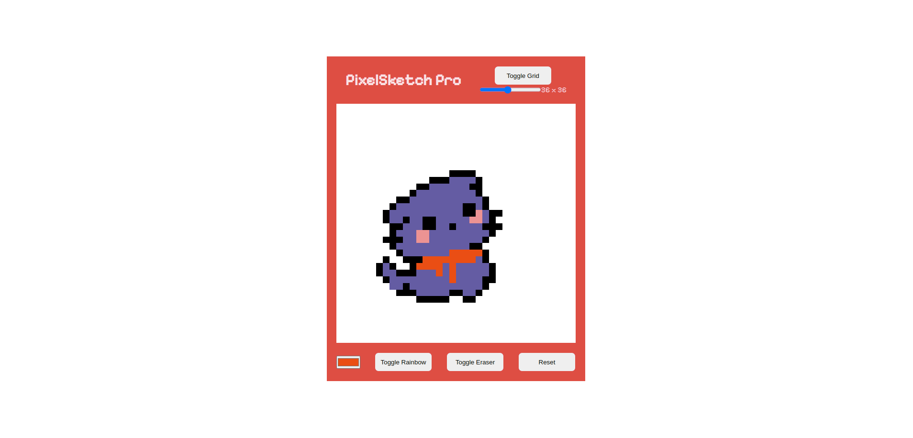

# PixelSketch Pro

PixelSketch Pro is a web-based pixel art drawing application that allows users to unleash their creativity by creating pixelated artworks. With a user-friendly interface and a range of features, it's the perfect tool for pixel art enthusiasts and digital artists.
[

## Live Website

https://idevravn.github.io/PixelSketch-Pro/

## Table of Contents

- [Features](#features)
- [Getting Started](#getting-started)
- [Built With](#built-with)
- [Contributing](#contributing)
- [License](#license)

## Features

- **Pixel Art Creation:** Design pixel art with ease using the intuitive drawing tools.
- **Show or Hide Grid:** Choose to hide the grid lines to get better art.
- **Adjustable Grid Size:** Customize the grid size to create detailed or larger artworks.
- **Color Picker:** Choose from a wide range of colors using the color picker tool.
- **Rainbow Mode:** Toggle rainbow mode to add vibrant and random colors to your canvas.
- **Eraser:** Easily erase parts of your artwork with the eraser tool.
- **Reset Button:** Quickly clear the canvas and start a new creation.

## Getting Started

To view the PixelSketch Pro Website:

1. Clone the repository: `git clone https://github.com/idevRavn/PixelSketch-Pro.git`
2. Open `index.html` in your preferred web browser.

## Built With

- HTML
- CSS
- JavaScript

## Contributing

Contributions are welcome! If you have ideas for improvement or want to add features, please fork the repository and submit a pull request.

## License

This project is licensed under the [MIT License](LICENSE), allowing for collaboration and sharing.
